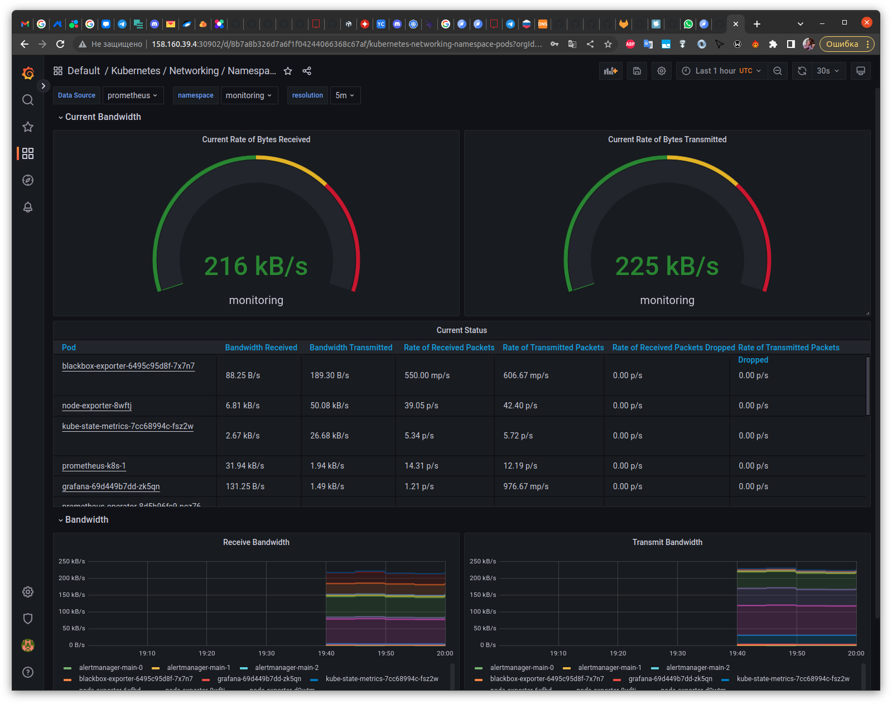
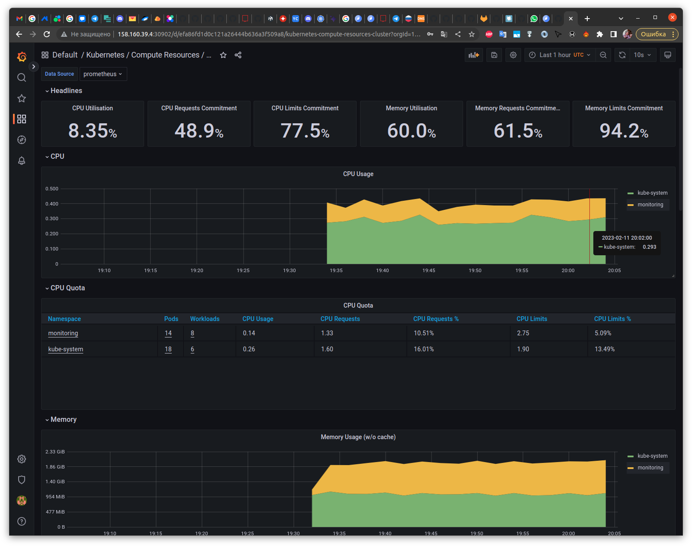
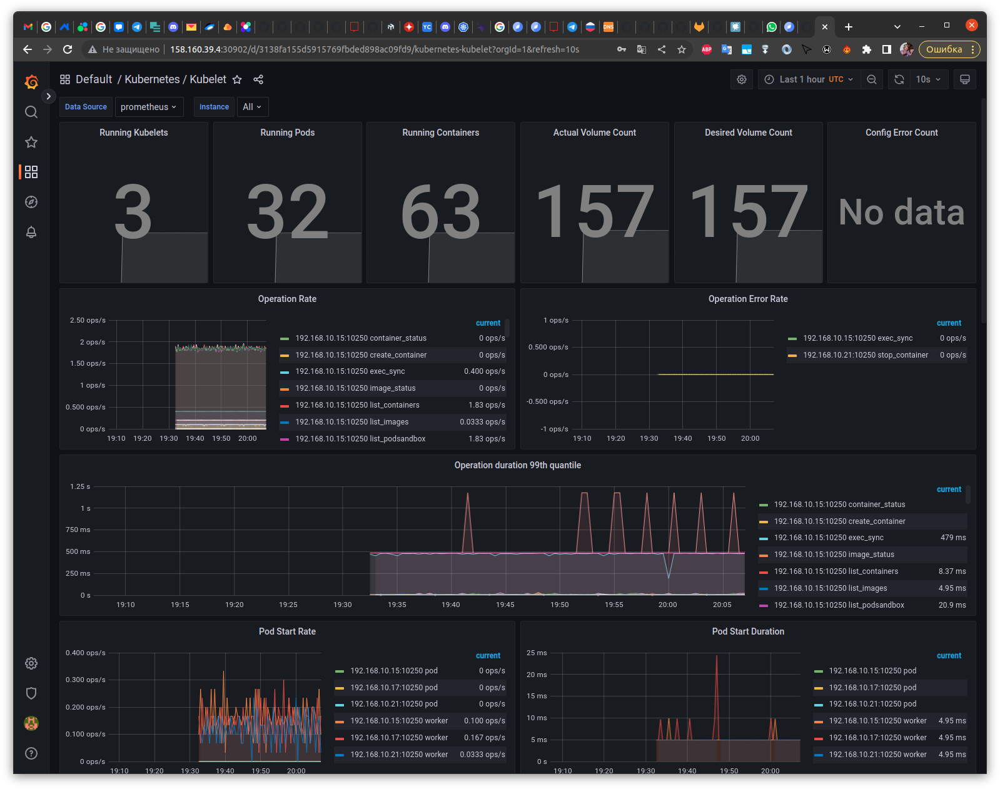
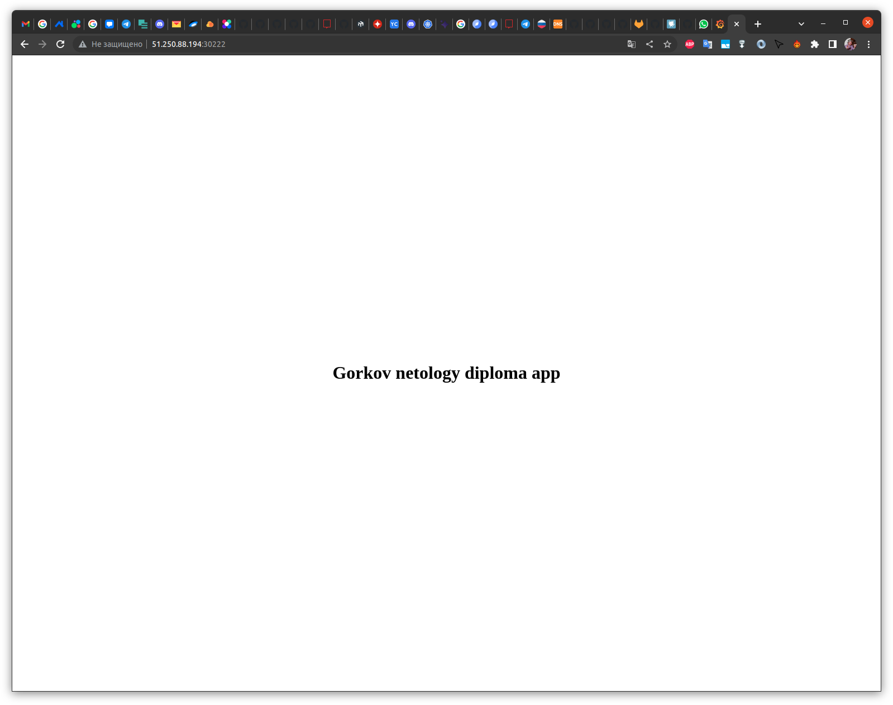

# Дипломный практикум в Yandex.Cloud
- [Дипломный практикум в Yandex.Cloud](#дипломный-практикум-в-yandexcloud)
  - [Цели:](#цели)
  - [Этапы выполнения:](#этапы-выполнения)
    - [Создание облачной инфраструктуры](#создание-облачной-инфраструктуры)
    - [Создание Kubernetes кластера](#создание-kubernetes-кластера)
    - [Создание тестового приложения](#создание-тестового-приложения)
    - [Подготовка cистемы мониторинга и деплой приложения](#подготовка-cистемы-мониторинга-и-деплой-приложения)
    - [Установка и настройка CI/CD](#установка-и-настройка-cicd)
  - [Что необходимо для сдачи задания?](#что-необходимо-для-сдачи-задания)
  - [Как правильно задавать вопросы дипломному руководителю?](#как-правильно-задавать-вопросы-дипломному-руководителю)

---
## Цели:

1. Подготовить облачную инфраструктуру на базе облачного провайдера Яндекс.Облако.
2. Запустить и сконфигурировать Kubernetes кластер.
3. Установить и настроить систему мониторинга.
4. Настроить и автоматизировать сборку тестового приложения с использованием Docker-контейнеров.
5. Настроить CI для автоматической сборки и тестирования.
6. Настроить CD для автоматического развёртывания приложения.

---
## Этапы выполнения:


### [Создание облачной инфраструктуры](https://github.com/DarkGarik/diplom/tree/0.1.0)

<details>
  <summary>Задание</summary>  

Для начала необходимо подготовить облачную инфраструктуру в ЯО при помощи [Terraform](https://www.terraform.io/).

Особенности выполнения:

- Бюджет купона ограничен, что следует иметь в виду при проектировании инфраструктуры и использовании ресурсов;
- Следует использовать последнюю стабильную версию [Terraform](https://www.terraform.io/).

Предварительная подготовка к установке и запуску Kubernetes кластера.

1. Создайте сервисный аккаунт, который будет в дальнейшем использоваться Terraform для работы с инфраструктурой с необходимыми и достаточными правами. Не стоит использовать права суперпользователя
2. Подготовьте [backend](https://www.terraform.io/docs/language/settings/backends/index.html) для Terraform:  
   а. Рекомендуемый вариант: [Terraform Cloud](https://app.terraform.io/)  
   б. Альтернативный вариант: S3 bucket в созданном ЯО аккаунте
3. Настройте [workspaces](https://www.terraform.io/docs/language/state/workspaces.html)  
   а. Рекомендуемый вариант: создайте два workspace: *stage* и *prod*. В случае выбора этого варианта все последующие шаги должны учитывать факт существования нескольких workspace.  
   б. Альтернативный вариант: используйте один workspace, назвав его *stage*. Пожалуйста, не используйте workspace, создаваемый Terraform-ом по-умолчанию (*default*).
4. Создайте VPC с подсетями в разных зонах доступности.
5. Убедитесь, что теперь вы можете выполнить команды `terraform destroy` и `terraform apply` без дополнительных ручных действий.
6. В случае использования [Terraform Cloud](https://app.terraform.io/) в качестве [backend](https://www.terraform.io/docs/language/settings/backends/index.html) убедитесь, что применение изменений успешно проходит, используя web-интерфейс Terraform cloud.

Ожидаемые результаты:

1. Terraform сконфигурирован и создание инфраструктуры посредством Terraform возможно без дополнительных ручных действий.
2. Полученная конфигурация инфраструктуры является предварительной, поэтому в ходе дальнейшего выполнения задания возможны изменения.  
---

</details>

1. Создание Сервисного аккаунта:  
   - В консоли управления создал сервисный аккаунт с ролью `admin`.  
   - Записал в файл авторизованный ключ для сервисного аккаунта:  
      ``` bash
      yc iam key create \
      --service-account-id <идентификатор_сервисного_аккаунта> \
      --folder-name <имя_каталога_с_сервисным_аккаунтом> \
      --output key.json
      ```
   - Создал профиль CLI для использования сервисного аккаунта:
      ``` bash
      yc config profile create yc-terraform
      ```
   - Задал конфигурацию профиля:
      ``` bash
      yc config set service-account-key key.json
      yc config set cloud-id <идентификатор_облака>
      yc config set folder-id <идентификатор_каталога>  
      ``` 
   -  Добавил в переменные аутентификационные данные:
      ``` bash
      export YC_TOKEN=$(yc iam create-token)
      export YC_CLOUD_ID=$(yc config get cloud-id)
      export YC_FOLDER_ID=$(yc config get folder-id)
      ```
2. Создал S3 bucket в ЯО с помощью terraform:  
   - [Конфигурация](bucket/) где создается сервисный аккаунт для работы с bucket и сам bucket.
   - В outputs выводиться ключ доступа и секретный ключ, которы потом необходим для подключения к bucket.  
3. Создал workspace `stage`:
   ``` bash
   terraform workspace new stage
   ```
4. Создал VPC `netology-net` с двумя подсетями `public` и `private`:  
   [Конфигурация](terraform/)

---
### [Создание Kubernetes кластера](https://github.com/DarkGarik/diplom/tree/0.2.0)

<details>
  <summary>Задание</summary> 

На этом этапе необходимо создать [Kubernetes](https://kubernetes.io/ru/docs/concepts/overview/what-is-kubernetes/) кластер на базе предварительно созданной инфраструктуры.   Требуется обеспечить доступ к ресурсам из Интернета.

Это можно сделать двумя способами:

1. Рекомендуемый вариант: самостоятельная установка Kubernetes кластера.  
   а. При помощи Terraform подготовить как минимум 3 виртуальных машины Compute Cloud для создания Kubernetes-кластера. Тип виртуальной машины следует выбрать самостоятельно с учётом требовании к производительности и стоимости. Если в дальнейшем поймете, что необходимо сменить тип инстанса, используйте Terraform для внесения изменений.  
   б. Подготовить [ansible](https://www.ansible.com/) конфигурации, можно воспользоваться, например [Kubespray](https://kubernetes.io/docs/setup/production-environment/tools/kubespray/)  
   в. Задеплоить Kubernetes на подготовленные ранее инстансы, в случае нехватки каких-либо ресурсов вы всегда можете создать их при помощи Terraform.
2. Альтернативный вариант: воспользуйтесь сервисом [Yandex Managed Service for Kubernetes](https://cloud.yandex.ru/services/managed-kubernetes)  
  а. С помощью terraform resource для [kubernetes](https://registry.terraform.io/providers/yandex-cloud/yandex/latest/docs/resources/kubernetes_cluster) создать региональный мастер kubernetes с размещением нод в разных 3 подсетях      
  б. С помощью terraform resource для [kubernetes node group](https://registry.terraform.io/providers/yandex-cloud/yandex/latest/docs/resources/kubernetes_node_group)
  
Ожидаемый результат:

1. Работоспособный Kubernetes кластер.
2. В файле `~/.kube/config` находятся данные для доступа к кластеру.
3. Команда `kubectl get pods --all-namespaces` отрабатывает без ошибок.

---

</details>

1. Добавил [kluster.tf](terraform/kluster.tf), в котором прописал создание одной мастер ноды и двух воркеров
2. Установил свежий `kubespray`, подготовил:
   ```bash
   git clone https://github.com/kubernetes-sigs/kubespray
   cd kubespray
   sudo pip3 install -r requirements.txt
   cp -rfp inventory/sample inventory/mycluster
   ```
3. Подготовил скрипт [generate_inventory.sh](terraform/generate_inventory.sh), который подсмотрел в репозитории ["Автоматизация установки Kubernetes кластера с помощью Kubespray и Terraform в Yandex Cloud"](https://github.com/patsevanton/kubespray_terraform_yandex_cloud)
4. Написал скрипт [get_conf.sh](terraform/get_conf.sh), который будет забирать конфиг `kubectl` из мастера на локальную машину и подготавливать его.
5. Далее по шагам разворачиваем с помощью `terraform` виртуальные машины, подготавливаем inventory с помощью скрипта, деплоим `kubernetes` с помощью `kubespray`, копируем конфиг себе на локальную машину, получаем вывод без ошибок команды `kubectl get pods --all-namespaces`:
   <details>
   <summary>Консоль:</summary> 

   ```bash
   gorkov@gorkov-big-home:~/homework/diplom$ cd terraform/
   gorkov@gorkov-big-home:~/homework/diplom/terraform$ export YC_TOKEN=$(yc iam create-token)
   gorkov@gorkov-big-home:~/homework/diplom/terraform$ terraform plan
   ...
   gorkov@gorkov-big-home:~/homework/diplom/terraform$ terraform apply
   ...
   gorkov@gorkov-big-home:~/homework/diplom/terraform$ bash generate_inventory.sh > ../kubespray/inventory/mycluster/inventory.ini 
   gorkov@gorkov-big-home:~/homework/diplom/terraform$ cd ../kubespray/
   gorkov@gorkov-big-home:~/homework/diplom/kubespray$ ansible-playbook -i inventory/mycluster/inventory.ini --become cluster.yml
   ...
   gorkov@gorkov-big-home:~/homework/diplom/kubespray$ cd ../terraform/
   gorkov@gorkov-big-home:~/homework/diplom/terraform$ bash get_conf.sh
   gorkov@gorkov-big-home:~/homework/diplom/terraform$ kubectl get pods --all-namespaces
   NAMESPACE     NAME                                       READY   STATUS    RESTARTS       AGE
   kube-system   calico-kube-controllers-7967fb4566-6jsks   1/1     Running   0              110m
   kube-system   calico-node-7qkgl                          1/1     Running   0              111m
   kube-system   calico-node-d2vsv                          1/1     Running   0              111m
   kube-system   calico-node-wk5bm                          1/1     Running   1 (111m ago)   111m
   kube-system   coredns-68868dc95b-zvmlr                   1/1     Running   0              110m
   kube-system   coredns-68868dc95b-zwznz                   1/1     Running   0              110m
   kube-system   dns-autoscaler-7ccd65764f-x4nrl            1/1     Running   0              110m
   kube-system   kube-apiserver-master-1                    1/1     Running   1              114m
   kube-system   kube-controller-manager-master-1           1/1     Running   1              114m
   kube-system   kube-proxy-8fbtb                           1/1     Running   0              112m
   kube-system   kube-proxy-qxqck                           1/1     Running   0              112m
   kube-system   kube-proxy-tb9fp                           1/1     Running   0              112m
   kube-system   kube-scheduler-master-1                    1/1     Running   1              114m
   kube-system   nginx-proxy-worker-1                       1/1     Running   0              111m
   kube-system   nginx-proxy-worker-2                       1/1     Running   0              111m
   kube-system   nodelocaldns-cnxph                         1/1     Running   0              110m
   kube-system   nodelocaldns-qbqvw                         1/1     Running   0              110m
   kube-system   nodelocaldns-xr88f                         1/1     Running   0              110m
   ```
   </details>

---
### [Создание тестового приложения](https://github.com/DarkGarik/diplom/tree/0.3.0)

<details>
  <summary>Задание</summary> 

Для перехода к следующему этапу необходимо подготовить тестовое приложение, эмулирующее основное приложение разрабатываемое вашей компанией.

Способ подготовки:

1. Рекомендуемый вариант:  
   а. Создайте отдельный git репозиторий с простым nginx конфигом, который будет отдавать статические данные.  
   б. Подготовьте Dockerfile для создания образа приложения.  
2. Альтернативный вариант:  
   а. Используйте любой другой код, главное, чтобы был самостоятельно создан Dockerfile.

Ожидаемый результат:

1. Git репозиторий с тестовым приложением и Dockerfile.
2. Регистр с собранным docker image. В качестве регистра может быть DockerHub или [Yandex Container Registry](https://cloud.yandex.ru/services/container-registry), созданный также с помощью terraform.

---

</details>

1. Подготовил статичный индекс [index.html](app/index.html) и докерфайл [Dockerfile](app/Dockerfile)
2. Собрал образ `docker build -t gorkov/app .` и запушил его в докерхаб `docker push gorkov/app` 
   <details>
   <summary>Консоль:</summary> 

   ```bash
   gorkov@gorkov-big-home:~/homework/diplom/app$ docker build -t gorkov/app .
   [+] Building 3.7s (8/8) FINISHED                                                                                                                                                                                                                      
   => [internal] load build definition from Dockerfile                                                                                                                                                                                             0.1s
   => => transferring dockerfile: 31B                                                                                                                                                                                                              0.1s
   => [internal] load .dockerignore                                                                                                                                                                                                                0.1s
   => => transferring context: 2B                                                                                                                                                                                                                  0.0s
   => [internal] load metadata for docker.io/library/nginx:latest                                                                                                                                                                                  3.2s
   => [auth] library/nginx:pull token for registry-1.docker.io                                                                                                                                                                                     0.0s
   => CACHED [1/2] FROM docker.io/library/nginx@sha256:6650513efd1d27c1f8a5351cbd33edf85cc7e0d9d0fcb4ffb23d8fa89b601ba8                                                                                                                            0.0s
   => [internal] load build context                                                                                                                                                                                                                0.1s
   => => transferring context: 383B                                                                                                                                                                                                                0.1s
   => [2/2] COPY index.html /usr/share/nginx/html/                                                                                                                                                                                                 0.1s
   => exporting to image                                                                                                                                                                                                                           0.1s
   => => exporting layers                                                                                                                                                                                                                          0.0s
   => => writing image sha256:22010009993c17a4067bb63a71102e1dbaf2b59710e0fa062d4f70fe610c75df                                                                                                                                                     0.0s
   => => naming to docker.io/gorkov/app                                                                                                                                                                                                            0.0s

   Use 'docker scan' to run Snyk tests against images to find vulnerabilities and learn how to fix them
   gorkov@gorkov-big-home:~/homework/diplom/app$ docker login -u gorkov
   Password: 
   Login Succeeded

   Logging in with your password grants your terminal complete access to your account. 
   For better security, log in with a limited-privilege personal access token. Learn more at https://docs.docker.com/go/access-tokens/
   gorkov@gorkov-big-home:~/homework/diplom/app$ docker push gorkov/app
   Using default tag: latest
   The push refers to repository [docker.io/gorkov/app]
   9b15d0187406: Pushed 
   3ea1bc01cbfe: Layer already exists 
   a76121a5b9fd: Layer already exists 
   2df186f5be5c: Layer already exists 
   21a95e83c568: Layer already exists 
   81e05d8cedf6: Layer already exists 
   4695cdfb426a: Layer already exists 
   latest: digest: sha256:8f1be0d1cd98ab1d9a7aa555defbd15196291a6c7e394a1de40ddf6befcbe729 size: 1777

   ```
   </details>

3. Регистр [https://hub.docker.com/r/gorkov/app](https://hub.docker.com/r/gorkov/app)


---
### [Подготовка cистемы мониторинга и деплой приложения](https://github.com/DarkGarik/diplom/tree/0.4.0)

<details>
  <summary>Задание</summary> 


Уже должны быть готовы конфигурации для автоматического создания облачной инфраструктуры и поднятия Kubernetes кластера.  
Теперь необходимо подготовить конфигурационные файлы для настройки нашего Kubernetes кластера.

Цель:
1. Задеплоить в кластер [prometheus](https://prometheus.io/), [grafana](https://grafana.com/), [alertmanager](https://github.com/prometheus/alertmanager), [экспортер](https://github.com/prometheus/node_exporter) основных метрик Kubernetes.
2. Задеплоить тестовое приложение, например, [nginx](https://www.nginx.com/) сервер отдающий статическую страницу.

Рекомендуемый способ выполнения:
1. Воспользовать пакетом [kube-prometheus](https://github.com/prometheus-operator/kube-prometheus), который уже включает в себя [Kubernetes оператор](https://operatorhub.io/) для [grafana](https://grafana.com/), [prometheus](https://prometheus.io/), [alertmanager](https://github.com/prometheus/alertmanager) и [node_exporter](https://github.com/prometheus/node_exporter). При желании можете собрать все эти приложения отдельно.
2. Для организации конфигурации использовать [qbec](https://qbec.io/), основанный на [jsonnet](https://jsonnet.org/). Обратите внимание на имеющиеся функции для интеграции helm конфигов и [helm charts](https://helm.sh/)
3. Если на первом этапе вы не воспользовались [Terraform Cloud](https://app.terraform.io/), то задеплойте в кластер [atlantis](https://www.runatlantis.io/) для отслеживания изменений инфраструктуры.

Альтернативный вариант:
1. Для организации конфигурации можно использовать [helm charts](https://helm.sh/)

Ожидаемый результат:
1. Git репозиторий с конфигурационными файлами для настройки Kubernetes.
2. Http доступ к web интерфейсу grafana.
3. Дашборды в grafana отображающие состояние Kubernetes кластера.
4. Http доступ к тестовому приложению.

---

</details>

1. Выбрал пакет `kube-prometheus` 
   - установку производил по инструкции [Customizing Kube-Prometheus](https://github.com/prometheus-operator/kube-prometheus/blob/main/docs/customizing.md)

      ```bash
      gorkov@gorkov-big-home:~/homework/diplom$ mkdir my-kube-prometheus; cd my-kube-prometheus
      gorkov@gorkov-big-home:~/homework/diplom/my-kube-prometheus$ go install -a github.com/jsonnet-bundler/jsonnet-bundler/cmd/jb@latest
      gorkov@gorkov-big-home:~/homework/diplom/my-kube-prometheus$ jb init
      gorkov@gorkov-big-home:~/homework/diplom/my-kube-prometheus$ jb install github.com/prometheus-operator/kube-prometheus/jsonnet/kube-prometheus@main
      gorkov@gorkov-big-home:~/homework/diplom/my-kube-prometheus$ wget https://raw.githubusercontent.com/prometheus-operator/kube-prometheus/main/example.jsonnet -O example.jsonnet
      gorkov@gorkov-big-home:~/homework/diplom/my-kube-prometheus$ wget https://raw.githubusercontent.com/prometheus-operator/kube-prometheus/main/build.sh -O build.sh
      ```
   - для доступа к `grafana` извне, в файле [example.jsonnet](my-kube-prometheus/example.jsonnet) раскомменитровал строку `(import 'kube-prometheus/addons/node-ports.libsonnet') +`, в файле [manifests/grafana-networkPolicy.yaml](my-kube-prometheus/manifests/grafana-networkPolicy.yaml) закомментировал блок: 
      ```
         - podSelector:
         matchLabels:
            app.kubernetes.io/name: prometheus
      ```
      внешний порт смотрим в файле [grafana-serviceAccount.yaml](my-kube-prometheus/manifests/grafana-serviceAccount.yaml) `nodePort: 30902` 
   - также по [инструкции](https://github.com/prometheus-operator/kube-prometheus/blob/main/docs/customizing.md#generating) перед компиляцией манифестов устанавливаем необходимые модули `go install github.com/brancz/gojsontoyaml@latest` и `go install github.com/google/go-jsonnet/cmd/jsonnet@latest`
   - компилируем манифесты `./build.sh example.jsonnet`
   - Устанавливаем Prometheus и Grafana

      <details>
      <summary>Консоль</summary> 

      ```bash
      gorkov@gorkov-big-home:~/homework/diplom/my-kube-prometheus$ kubectl apply --server-side -f manifests/setup
      gorkov@gorkov-big-home:~/homework/diplom/my-kube-prometheus$ kubectl apply -f manifests/
      gorkov@gorkov-big-home:~/homework/diplom/my-kube-prometheus$ kubectl get -n monitoring deploy,po,svc
      NAME                                  READY   UP-TO-DATE   AVAILABLE   AGE
      deployment.apps/blackbox-exporter     1/1     1            1           26m
      deployment.apps/grafana               1/1     1            1           26m
      deployment.apps/kube-state-metrics    1/1     1            1           26m
      deployment.apps/prometheus-adapter    2/2     2            2           26m
      deployment.apps/prometheus-operator   1/1     1            1           28m

      NAME                                      READY   STATUS    RESTARTS   AGE
      pod/alertmanager-main-0                   2/2     Running   0          26m
      pod/alertmanager-main-1                   2/2     Running   0          26m
      pod/alertmanager-main-2                   2/2     Running   0          26m
      pod/blackbox-exporter-6495c95d8f-7x7n7    3/3     Running   0          26m
      pod/grafana-69d449b7dd-zk5qn              1/1     Running   0          26m
      pod/kube-state-metrics-7cc68994c-fsz2w    3/3     Running   0          26m
      pod/node-exporter-6xfhd                   2/2     Running   0          26m
      pod/node-exporter-8wftj                   2/2     Running   0          26m
      pod/node-exporter-d9wtm                   2/2     Running   0          26m
      pod/prometheus-adapter-779df64887-7m8dl   1/1     Running   0          26m
      pod/prometheus-adapter-779df64887-kmf8x   1/1     Running   0          26m
      pod/prometheus-k8s-0                      2/2     Running   0          26m
      pod/prometheus-k8s-1                      2/2     Running   0          26m
      pod/prometheus-operator-8d5b96fc9-ncz76   2/2     Running   0          28m

      NAME                            TYPE        CLUSTER-IP      EXTERNAL-IP   PORT(S)                      AGE
      service/alertmanager-main       NodePort    10.233.2.92     <none>        9093:30903/TCP               26m
      service/alertmanager-operated   ClusterIP   None            <none>        9093/TCP,9094/TCP,9094/UDP   26m
      service/blackbox-exporter       ClusterIP   10.233.5.23     <none>        9115/TCP,19115/TCP           26m
      service/grafana                 NodePort    10.233.15.165   <none>        3000:30902/TCP               26m
      service/kube-state-metrics      ClusterIP   None            <none>        8443/TCP,9443/TCP            26m
      service/node-exporter           ClusterIP   None            <none>        9100/TCP                     26m
      service/prometheus-adapter      ClusterIP   10.233.20.240   <none>        443/TCP                      26m
      service/prometheus-k8s          NodePort    10.233.49.249   <none>        9090:30900/TCP               26m
      service/prometheus-operated     ClusterIP   None            <none>        9090/TCP                     26m
      service/prometheus-operator     ClusterIP   None            <none>        8443/TCP                     28m
      ```
      
      </details>

   -  веб интерфейс `grafana`:
      <details>
      <summary>Скриншоты</summary> 

        
        
        

      </details>
2. Для деплоя приложения выбрал `qbec`
   - Создал минимальный [конфиг для `qbec`](app/qbec/)
   - Написал скрипт [genererate_qbec.sh](terraform/genererate_qbec.sh) для генерации файла [qbec.yaml](app/qbec/qbec.yaml) `gorkov@gorkov-big-home:~/homework/diplom/terraform$ bash genererate_qbec.sh > ../app/qbec/qbec.yaml`
   - Доступ к приложение по `http`, порт `30222`
      <details>
      <summary>Скриншот</summary> 

        

      </details>


---
### Установка и настройка CI/CD

Осталось настроить ci/cd систему для автоматической сборки docker image и деплоя приложения при изменении кода.

Цель:

1. Автоматическая сборка docker образа при коммите в репозиторий с тестовым приложением.
2. Автоматический деплой нового docker образа.

Можно использовать [teamcity](https://www.jetbrains.com/ru-ru/teamcity/), [jenkins](https://www.jenkins.io/) либо [gitlab ci](https://about.gitlab.com/stages-devops-lifecycle/continuous-integration/)

Ожидаемый результат:

1. Интерфейс ci/cd сервиса доступен по http.
2. При любом коммите в репозиторие с тестовым приложением происходит сборка и отправка в регистр Docker образа.
3. При создании тега (например, v1.0.0) происходит сборка и отправка с соответствующим label в регистр, а также деплой соответствующего Docker образа в кластер Kubernetes.

---
## Что необходимо для сдачи задания?

1. Репозиторий с конфигурационными файлами Terraform и готовность продемонстрировать создание всех ресурсов с нуля.
2. Пример pull request с комментариями созданными atlantis'ом или снимки экрана из Terraform Cloud.
3. Репозиторий с конфигурацией ansible, если был выбран способ создания Kubernetes кластера при помощи ansible.
4. Репозиторий с Dockerfile тестового приложения и ссылка на собранный docker image.
5. Репозиторий с конфигурацией Kubernetes кластера.
6. Ссылка на тестовое приложение и веб интерфейс Grafana с данными доступа.
7. Все репозитории рекомендуется хранить на одном ресурсе (github, gitlab)

---
## Как правильно задавать вопросы дипломному руководителю?

Что поможет решить большинство частых проблем:

1. Попробовать найти ответ сначала самостоятельно в интернете или в 
  материалах курса и ДЗ и только после этого спрашивать у дипломного 
  руководителя. Скилл поиска ответов пригодится вам в профессиональной 
  деятельности.
2. Если вопросов больше одного, то присылайте их в виде нумерованного 
  списка. Так дипломному руководителю будет проще отвечать на каждый из 
  них.
3. При необходимости прикрепите к вопросу скриншоты и стрелочкой 
  покажите, где не получается.

Что может стать источником проблем:

1. Вопросы вида «Ничего не работает. Не запускается. Всё сломалось». 
  Дипломный руководитель не сможет ответить на такой вопрос без 
  дополнительных уточнений. Цените своё время и время других.
2. Откладывание выполнения курсового проекта на последний момент.
3. Ожидание моментального ответа на свой вопрос. Дипломные руководители работающие разработчики, которые занимаются, кроме преподавания, 
  своими проектами. Их время ограничено, поэтому постарайтесь задавать правильные вопросы, чтобы получать быстрые ответы :)